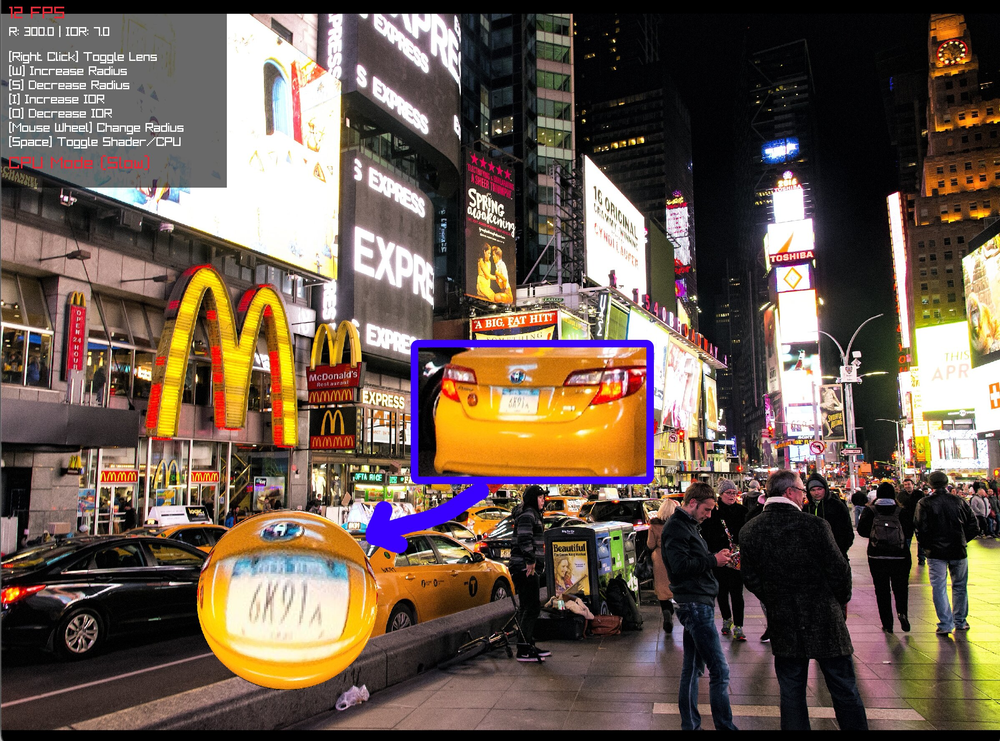
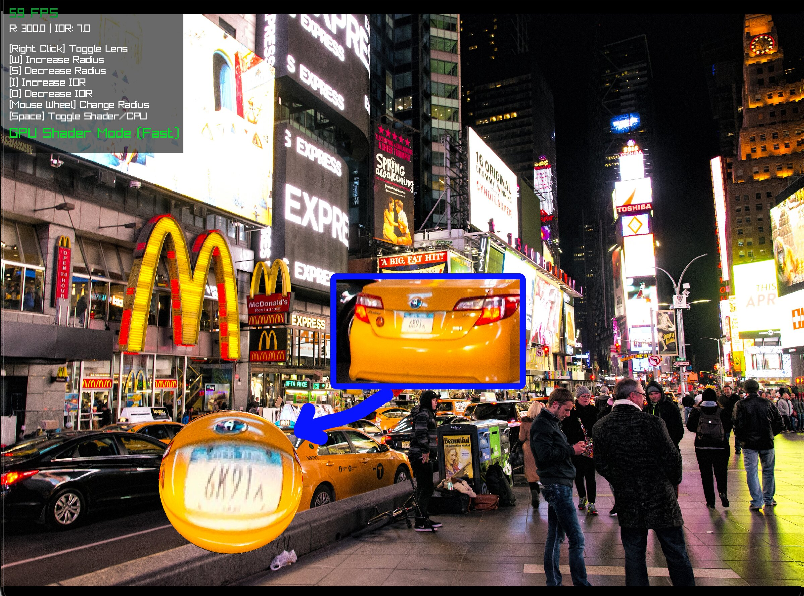
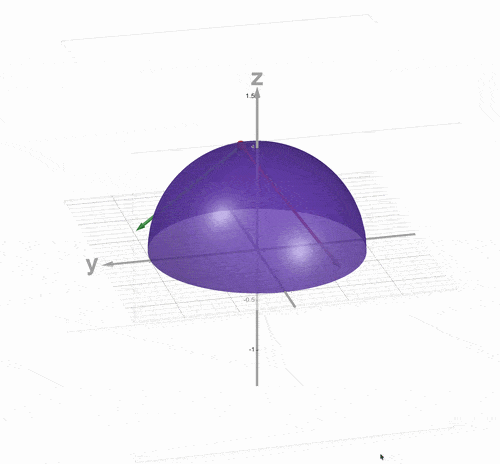
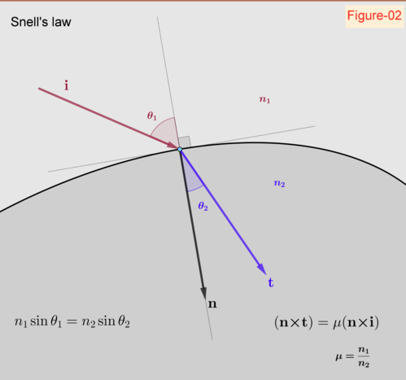

# Snell's Lens

| CPU Mode (Slow) | GPU Shader Mode (Fast) |
| --- | --- |
|  |  |

A small Raylib demo that simulates a glass lens warping an image through Snell's law in vector form.

## Project Overview

The program renders a movable circular lens over an image and refracts pixels through a hemisphere-shaped surface. It has two implementations of the same effect:

- `main.c` handles the window, image loading, input, and the CPU/GPU rendering switch.
- `lens_shader.glsl` mirrors the same lens math in a fragment shader for the GPU path.

## Controls

- Drag and drop an image to load it.
- Right click to toggle the lens.
- `Space` to switch between CPU and shader mode.
- Mouse wheel or `W` / `S` to change lens radius.
- `I` / `O` to change index of refraction.
- `D` to print debug values for the current refracted pixel.

## References

- [Snell's law in vector form](https://physics.stackexchange.com/questions/435512/snells-law-in-vector-form)
- [OpenGL `refract`](https://registry.khronos.org/OpenGL-Refpages/gl4/html/refract.xhtml)
- [Video reference](https://www.youtube.com/watch?v=0OvhpQVTS2Q)
- [Desmos sketch](https://www.desmos.com/3d/eebbaskabr)

## Theory

| | |
| --- | --- |
| [](https://www.desmos.com/3d/eebbaskabr) | [](https://physics.stackexchange.com/questions/435512/snells-law-in-vector-form) |

The lens surface is treated as a hemisphere centered on the cursor. For any pixel inside the lens radius, the code finds the corresponding point on the hemisphere, derives the surface normal, and refracts the incoming ray through the interface.

The refraction step uses the vector form of Snell's law:

```text
t = μ i + n * sqrt(1 - μ² (1 - (n · i)²)) - μ n (n · i)
```

where:

- `i` is the incident ray
- `t` is the transmitted ray
- `n` is the surface normal
- `μ = n1 / n2`

That same refraction model is used in both the CPU helper and the shader, so the two modes stay visually consistent while showing different performance characteristics.
